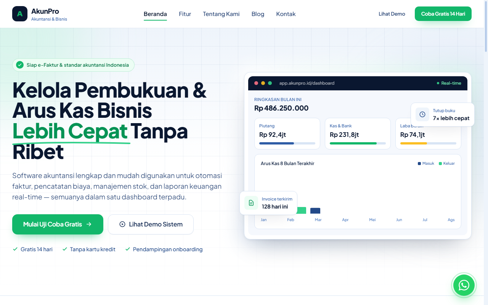

# 📊 AkunPro — Accounting Software Landing Page

> Template landing page 5 halaman modern dan responsif untuk produk software akuntansi, SaaS, dan aplikasi bisnis.

---

### 🌐 Preview Tampilan

🔗 **Buka Demo Website:** [https://ophari.github.io/accounting-landing-page/](https://ophari.github.io/accounting-landing-page/)

---

### 📄 Halaman yang Tersedia

* **Beranda (`index.html`)** — Hero section, interactive dashboard tab showcase, 6 modul utama, social proof, dan testimoni.
* **Fitur (`features.html`)** — Breakdown modul detail layout zig-zag dan matriks perbandingan paket.
* **Tentang Produk (`about.html`)** — Arsitektur software, pilar keamanan data finansial, dan standar kepatuhan akuntansi.
* **Blog (`blog.html`)** — Arsip artikel edukasi keuangan dengan fitur pencarian dan filter kategori.
* **Kontak (`contact.html`)** — Formulir permohonan demo dengan validasi input, lokasi, dan integrasi WhatsApp.

---

### 🛠️ Tech Stack

* **HTML5** & **Vanilla JavaScript** (Interaktif tanpa framework berat)
* **Tailwind CSS** (Modern utility-first styling)
* **Responsive Mobile-First** (Optimal di Smartphone, Tablet, & Desktop)
